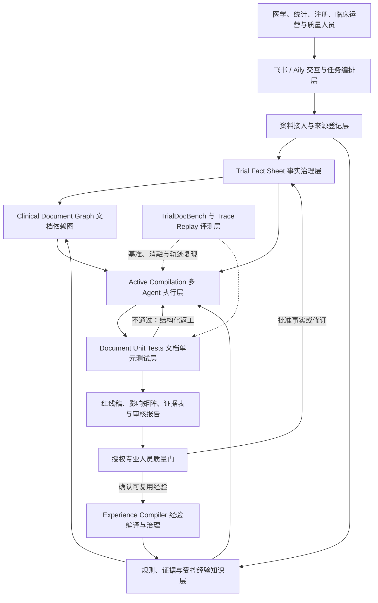

# 2. 整体架构与核心功能模块

> 医学资料整合提示：Clinical Document Graph 需要同时覆盖 protocol nodes、table nodes、associated-document nodes 和 execution-system nodes；文档单元测试也需要覆盖数值一致、语义一致、统计一致和执行一致四层检查。

- 项目名称：TrialCompiler
- 参赛场景：AI 先锋未来人才大赛，健康元临床开发效率方向
- 当前版本：v1.0
- 日期：2026-07-17
- 当前验证边界：公开资料桌面研究与完全合成数据评测

## A. 简短版

TrialCompiler 采用“飞书交互与任务编排层 + 临床文档编译核心 + 人工审核质量门”的整体架构。用户首先在飞书中上传已获授权的研究资料、选择文档任务并确认任务范围；系统从资料中提取候选研究事实，由医学、统计、注册等专业人员确认后形成具有来源、版本、适用范围和审核状态的 Trial Fact Sheet。系统随后建立研究事实与方案章节、表格及关联文件之间的文档依赖图，并基于已确认事实辅助分章节编制、执行一致性检查和分析事实变更的影响范围。

系统的核心不是一次性生成长文，而是把临床试验方案处理为可编译、可测试、可追踪、可增量更新的文档工程。架构中严格区分三类知识：项目事实回答“本项研究采用什么设计”，规则约束回答“文档需要满足什么要求”，经审核经验回答“在相似条件下曾如何发现和处理问题”。三类知识分别管理来源、版本、适用范围、审核状态和访问权限，避免把历史项目意见直接误用为当前项目事实。

在执行层，系统通过多个职责分离的 Agent 完成上下文确认、证据检索、候选文本生成、独立质量检查、结果汇总和经验提炼。生成 Agent 与评审 Agent 之间允许有限次数的返工，但任何关键事实生效、医学或统计判断、正式修订和文档批准都必须经过授权专业人员确认。最终输出包括 Trial Fact Sheet、候选章节、问题清单、影响矩阵、红线稿、证据表、审核报告和完整审计轨迹。

当前比赛原型只使用网上公开资料和完全合成案例构建知识库与测试集，不接触真实患者信息、企业内部方案或真实临床项目。后续在获得正式授权、访问控制和数据治理条件后，才考虑接入真实业务环境。

## B. 详细版

## 1. 架构设计原则

TrialCompiler 的整体架构遵循以下原则：

1. **事实先于文本**：先确认研究设计事实，再生成或修改文档，不让模型在长文中自行猜测关键设计。
2. **来源可追溯**：每项事实、规则、建议和修改都必须能够回到来源文件、具体位置、版本与责任人。
3. **确定性检查优先**：数字、时间点、编号、术语和旧值残留等问题优先由规则程序检查，语义模型用于处理规则难以覆盖的冲突。
4. **增量修改优先**：事实变化后只定位并修订受影响内容，不对整套文档进行不可控重写。
5. **生成与评审分离**：候选文本生成、缺陷检测、质量判断和最终汇总由不同职责模块承担，降低自我确认偏差。
6. **专业人员保留决策权**：AI 输出始终是候选结果，关键事实、风险处置和正式版本均由授权人员确认。
7. **知识分层治理**：项目事实、规则约束和专家经验不混存、不混用，并记录各自的适用边界。
8. **全过程可审计**：系统保存输入来源、模型版本、检索证据、规则命中、人工决定和版本变化。
9. **以评测驱动开发**：通过合成缺陷集、基线方法和消融实验验证各模块是否真正降低错误，而不是仅展示界面。

## 2. 整体分层架构



这套架构可分为八个协同层次：

1. 飞书交互与任务编排层；
2. 资料接入、解析与来源登记层；
3. Trial Fact Sheet 项目事实治理层；
4. 规则、证据与受控经验知识层；
5. Clinical Document Graph 文档依赖层；
6. Active Compilation 多 Agent 执行层；
7. 文档单元测试、人工审核与审计层；
8. TrialDocBench 评测与轨迹复现层。

### 2.1 一条受控数据主线与三条横向控制线

从业务数据流看，上述分层可以进一步压缩为一条受控主线：

```text
企业授权资料与适用规则
→ 文档解析与候选事实抽取
→ Trial Fact Sheet 人工确认
→ 事实—章节—表格—文件依赖图
→ 分章节编译与文档单元测试
→ 受控候选交付物
→ 人工质量门
→ 企业 DMS / 正式质量体系
```

数据安全、质量控制和责任控制三条横向控制线贯穿整条主线：

| 控制线 | 核心控制 | 当前原型边界 |
| --- | --- | --- |
| 数据安全线 | 项目隔离、最小授权、敏感信息识别与脱敏、读取与导出日志 | 只使用公开资料和完全合成案例；不声称已实现生产级租户隔离与长期审计 |
| 质量控制线 | 来源与版本、独立验证集、漏检率、误报率、人工推翻率、高风险复核 | 已建立来源索引、测试目录和合成基准骨架；仍需端到端实跑结果 |
| 责任控制线 | AI 输出候选内容，专业人员确认关键事实和风险，DMS 完成正式发布 | 比赛原型展示人工质量门，不替代医学、统计、注册、伦理或企业质量批准 |

这三条控制线从任务发起时即生效，而不是在交付阶段追加免责声明。

## 3. 飞书交互与任务编排层

飞书 AI 是产品的业务入口，而不是替代 TrialCompiler 核心能力的普通聊天窗口。用户在飞书中完成：

- 创建或选择项目；
- 上传具有访问权限的研究资料；
- 选择方案编制、一致性审核或变更影响分析任务；
- 接收缺失信息补问；
- 审阅候选事实及其来源证据；
- 对候选修订执行接受、修改或拒绝；
- 查看问题清单、红线稿、影响矩阵和审核状态；
- 发起跨职能协作和审批。

Aily 负责识别任务意图、补问必要信息、调度后端工作流和把结构化结果返回给用户。它不直接把未经确认的自然语言答案写入正式事实层，也不绕过企业现有审批流程发布文件。

## 4. 资料接入与来源登记模块

该模块处理法规指南、公开模板、研究背景资料、历史版本、表格和会议结论等输入，主要功能包括：

1. 文件登记与哈希校验；
2. 文档类型识别；
3. Word、PDF、表格和扫描件解析；
4. 页码、章节、段落、表格单元格等位置锚定；
5. OCR 结果与原始图像关联；
6. 版本、发布日期、发布机构和访问权限记录；
7. 重复文件与近重复文本识别；
8. 来源有效性和过期状态标记。

每个可被后续系统引用的对象都保留 `source_id`、文件版本、具体位置和解析方法，使模型输出能够被复核，而不是只给出无法定位的“根据资料可知”。

## 5. Trial Fact Sheet 事实治理模块

Trial Fact Sheet 是整个系统的事实源。AI 可以从资料中提取候选事实，但候选事实只有经过相应专业人员确认后，才可进入有效状态并用于文档编制。

### 5.1 典型事实类型

- 主要终点与次要终点；
- 终点评估时间；
- 目标样本量；
- 研究人群；
- 入组与排除标准；
- 给药方案；
- 访视安排；
- 安全性评估内容；
- 分析集与统计原则；
- 研究阶段和适应症等项目上下文。

### 5.2 事实状态机

```text
candidate 候选
    ↓ 专业人员确认
confirmed 已确认
    ↓ 正式生效
effective 有效
    ↓ 新版本替代
superseded 已被替代
    ↓ 必要时归档
archived 已归档
```

每项事实记录当前值、历史值、来源、提出人、审核人、适用范围、生效状态、置信信息和受影响文档位置。事实发生变化时，系统创建新版本，而不是覆盖旧值，从而保留完整变更链。

## 6. 规则、证据与受控经验知识层

该层严格区分三类语义元素：

| 类型 | 回答的问题 | 示例 | 是否可直接当作项目事实 |
| --- | --- | --- | --- |
| Project Fact | 本项研究采用什么设计 | 主要终点评估时间为 Week 16 | 仅经确认后可以 |
| Rule Constraint | 文档需要满足什么规则 | 终点应在摘要、正文和统计描述中保持一致 | 不可以 |
| Approved Experience | 相似条件下曾如何发现和处理问题 | 修改终点时间时需要同步检查访视表和统计章节 | 不可以 |

系统将每条知识组织为 Clinical Semantic Element，包含规范化语义键、内容值、来源证据、适用治疗领域、试验阶段、文档类型、版本、审核状态、权限、稳定性和访问频次等元数据。

检索采用由粗到细的路径：

```text
规范化精确匹配
    ↓
BM25 / 向量召回候选
    ↓
适用范围、版本、审核状态和权限硬门控
    ↓
语义等价判断
    ↓
带来源证据返回
```

候选知识只有同时满足语义相符、范围匹配、版本有效、人工批准和访问允许，才可进入后续工作流。该设计防止“语义看起来相似，但项目、阶段或版本不适用”的错误引用。

## 7. Clinical Document Graph 文档依赖图

文档依赖图用于表示研究事实、规则、章节、表格、关联文件和审核结论之间的关系。核心节点包括：

- Fact：研究事实；
- Rule：规则约束；
- Section：文档章节；
- Table：表格或单元格区域；
- Document：方案或关联文件；
- Issue：检测到的问题；
- Revision：候选修订；
- Decision：人工审核决定。

典型边包括：

- `MENTIONED_IN`：事实出现于某章节；
- `CONSTRAINED_BY`：事实或章节受某规则约束；
- `AFFECTS`：事实变化可能影响某内容；
- `DERIVED_FROM`：候选文本来源于某事实或证据；
- `CONFLICTS_WITH`：两个表达存在冲突；
- `SUPERSEDES`：新版本替代旧版本；
- `APPROVED_BY`：由特定角色审核批准。

当某一事实发生变更时，系统沿依赖图计算可达的受影响节点，形成影响集合，再结合规则和语义复核去除无关位置。这样既避免漏改，也避免把整套文件全部重写。

## 8. 分章节辅助编制模块

系统基于已确认事实、适用模板和规则约束生成候选章节，不允许模型自由补充未确认的关键研究设计。模块支持：

- 方案摘要；
- 研究目的与终点；
- 研究设计；
- 研究人群；
- 给药和访视安排；
- 安全性评估；
- 统计分析原则；
- 关联表格和说明文本。

每段候选文本都关联使用过的事实、规则、来源与生成版本。事实不足时，系统返回待确认项，不以猜测填补空缺。

## 9. 文档单元测试模块

文档单元测试由确定性检查与语义检查共同组成。

### 9.1 确定性检查

- 数字、单位、样本量和比例一致性；
- 时间点和访视窗口一致性；
- 术语、缩写和名称一致性；
- 章节、表格、图和引用编号完整性；
- 必备章节和模板字段是否缺失；
- 旧版本值是否残留；
- 正文与表格的直接值冲突。

### 9.2 语义检查

- 同一终点是否被不同语言定义为不同概念；
- 研究目的、终点和统计原则是否出现逻辑不一致；
- 入排标准与目标人群是否潜在冲突；
- 访视安排是否覆盖关键评估；
- 候选修订是否改变了原有含义；
- 规则是否被错误应用到不匹配的场景。

系统对每个问题输出严重度、证据位置、涉及事实、命中规则、解释和候选修订。涉及临床合理性、统计科学性或法规解释的内容只提供审核线索，不自动作出专业结论。

## 10. 增量修改传播模块

当授权人员确认某项事实的新版本后，系统执行：

1. 创建候选新事实版本；
2. 计算文档依赖图中的受影响范围；
3. 定位旧值及其语义变体；
4. 识别直接影响与间接影响；
5. 生成候选修订；
6. 执行修改后的单元测试；
7. 生成影响矩阵和红线对照；
8. 提交相应专业角色审核；
9. 审核通过后形成新版本；
10. 保留完整审计轨迹。

这一机制相当于文档工程中的增量编译：只有受影响部分被重新生成和测试，未受影响内容保持稳定。

## 11. Active Compilation 多 Agent 执行层

系统采用职责清晰的 A-F Agent 协作，但用户看到的是统一任务流程，而不是要求用户理解内部 Agent 名称。

| Agent | 职责 | 关键输出 |
| --- | --- | --- |
| A：Context & Scope Agent | 确认项目、文档、任务范围、专业角色和不可越权边界 | 结构化任务上下文 |
| B：Knowledge & Evidence Agent | 检索已确认事实、适用规则和受控经验，并校验来源 | 证据包与适用性说明 |
| C：Writer / Repair Agent | 生成章节草稿或最小候选修订 | 带事实引用的候选文本 |
| D：Quality Judge Agent | 执行确定性与语义检查，判断是否需要返工 | 缺陷表、严重度和返工指令 |
| E：Reporter Agent | 汇总结果并生成红线稿、影响矩阵、证据表和审核报告 | 面向人的最终候选交付物 |
| F：Experience Miner Agent | 从已完成人工审核的案例中提炼候选经验 | 待批准 Decision Capsule |

C 与 D 之间可以进行有限次数的闭环修复。达到轮次上限、证据不足、规则冲突或问题涉及专业判断时，系统立即升级到人工审核，避免无限循环或用语言流畅度掩盖事实问题。

## 12. Experience Compiler 专家经验治理模块

专家意见不会被模型直接记成永久规则。系统先把一次审核过程压缩为 Decision Capsule，记录：

- 当时的上下文；
- 发现的问题；
- 使用的证据；
- 专家决定；
- 实际修改；
- 适用范围；
- 反例和不适用条件；
- 审核人和有效期。

只有经过授权人员确认、去标识化和适用范围标注后，Decision Capsule 才可被编译成可复用的 Action Card。项目专属意见默认不能提升为企业通用规则；相互冲突的经验并存时，系统保留各自上下文并提示人工判断。

## 13. 输出、审核与审计模块

TrialCompiler 的交付物不是一个聊天答案，而是一组可审核对象：

- Trial Fact Sheet；
- 待确认事实清单；
- 分章节候选草稿；
- 缺陷与风险清单；
- 变更影响矩阵；
- 修改前后红线稿；
- 事实与规则证据表；
- 人工审核任务；
- 版本差异与批准状态；
- Agent 执行轨迹和工具调用记录；
- 可复用经验候选；
- 综合审核报告。

审计记录至少包含操作者、时间、输入版本、模型与提示词版本、检索证据、规则命中、候选输出、人工修改和最终决定。系统应支持按角色和项目进行访问控制，并保证不同项目资料隔离。

### 13.1 角色责任与正式发布边界

| 主体 | 系统内职责 | 明确边界 |
| --- | --- | --- |
| 飞书 Aily | 自然语言交互、资料与任务接入、补问、事实确认卡、任务分派和状态展示 | 不作最终医学、统计、注册或质量判断 |
| TrialCompiler / AI | 解析授权资料，提出候选事实、候选章节、影响范围和审核问题，执行依赖分析与文档测试 | 不静默覆盖正式文件，不把未知信息写成确定事实 |
| 专业审核人员 | 按岗位确认医学、统计、注册、运营和质量内容，接受、修改或拒绝 AI 建议并说明理由 | 对各自专业判断负责 |
| 项目负责人 / 批准者 | 确认任务范围、未决风险和跨角色冲突，决定是否进入正式发布流程 | 不能以系统质量门替代组织批准 |
| 企业 DMS / 质量体系 | 正式版本控制、签核、发布、归档、留存和审计 | 构成企业制度性记录，比赛原型不替代该系统 |

## 14. TrialDocBench 与 Trace Replay 评测模块

TrialDocBench 用于在没有真实企业案例的当前阶段量化系统能力。测试任务按层次组织：

1. 事实抽取与来源定位；
2. 知识适用性判断；
3. 跨章节缺陷检测；
4. 变更影响范围识别；
5. 最小修订生成；
6. 经验适用边界判断；
7. 审计轨迹完整性。

Trace Replay 保存每次任务的输入、检索、Agent 状态、规则结果、人工反馈和最终输出，使同一案例能够在不同模型、不同检索策略和不同规则版本下重复运行。评测可以比较：普通大模型、长上下文提示、普通 RAG、单 Agent、无依赖图系统和完整 TrialCompiler。

## 15. 当前 MVP 与后续演进

### 15.1 当前比赛 MVP

- 只使用公开法规、指南、模板、论文和公开产品资料；
- 由团队负责技术性数据整理、清洗和结构化；
- 使用完全合成的临床方案片段与人工注入缺陷；
- 实现核心事实表、依赖图、一致性检查、变更传播和审核输出；
- 通过 TrialDocBench 进行基线、消融和可复现评测；
- 不处理真实患者数据、企业内部方案或真实临床项目。

### 15.2 后续演进

- 在正式授权条件下接入企业模板和受控项目资料；
- 扩展 Word 修订、表格解析和多文件联动；
- 建立更完整的 RBAC、审批、电子签名和审计机制；
- 由企业专家共同治理规则库和经验库；
- 开展真实工作流中的盲评、时间节省和遗漏率评估；
- 接入企业现有文档管理与质量体系。

## 16. 异常处理与人工升级

以下情况必须停止自动传播并转交专业人员：

- 候选事实来源相互矛盾；
- 事实缺乏可定位来源；
- 规则版本或适用范围不清；
- 修改涉及主要终点、样本量、统计假设或注册策略等关键判断；
- 依赖图无法确认影响边界；
- 多轮修复后仍存在高严重度问题；
- 模型输出超出授权资料范围；
- 涉及个人敏感信息或访问权限异常。

系统不以“生成了答案”为完成标准，而以“事实来源清楚、影响范围可解释、测试结果可复核、责任人完成确认”为完成标准。

## 17. 一句话总结

> TrialCompiler 通过飞书连接人和任务，以 Trial Fact Sheet 统一研究事实，以 Clinical Document Graph 管理跨文档依赖，以多 Agent 和文档单元测试完成候选编制与质量复核，再通过人工质量门和 Experience Compiler 保证结果可控、可追溯并能够持续积累。
