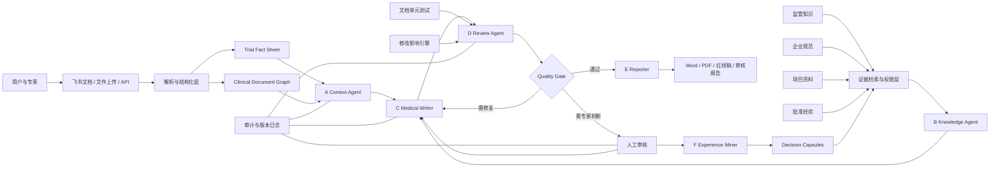

# TrialCompiler 详细方案与系统设计

- 文档状态：产品与技术总体设计稿
- 版本：v0.2
- 更新日期：2026-07-17
- 适用范围：2026 AI 先锋未来人才大赛原型、产品验证、技术研发与答辩材料

> 产品范围、专业责任边界和标准工作流以 [`product_definition_zh.md`](product_definition_zh.md) 为权威基线；技术贡献与已有方法边界见 [`technical_innovations_zh.md`](technical_innovations_zh.md)。本文件负责展开系统实现，不得自行扩大产品范围。

> 竞品分析后的设计约束：HumanTrue、Cori Clinical、Clinials 等直接竞品已经覆盖协议智能、跨文档一致性、修订协同和来源追踪等能力；Veeva、太美医疗、Medidata、IQVIA 等平台则占据受控文档、临床运营或上游方案设计优化位置。因此 TrialCompiler 的原型重点不应停留在“生成一段更像方案的文字”，而应证明 **确认事实层 + 临床文档依赖图 + 文档单元测试 + 变更影响闭环 + 专家经验治理** 这条系统路径。

## 0. 使用边界与安全声明

TrialCompiler 是面向临床试验方案设计阶段文档编制、一致性审核与变更影响分析的研究原型，目标是辅助合格人员组织事实、检索依据、发现文档问题、传播修改影响并沉淀审核经验。当前竞赛范围不延伸至患者病历筛查和临床数据清洗。它不替代医学、统计、法规、药物警戒或伦理专家，不提供诊断、治疗、受试者入组或监管批准决策，也不得在缺少合格人员复核的情况下生成可直接投入真实临床试验执行的最终文件。

系统必须遵守以下底线：

1. 不虚构试验事实、文献证据、法规条款、数据结果或专家意见。
2. 无法确认的信息必须显式标记为 `unknown`、`unverified` 或 `requires_human_review`。
3. 所有高风险生成内容都必须能够追溯到来源、模型版本、提示词版本、输入事实和人工审核记录。
4. 真实患者身份信息、企业机密和未授权临床数据不得进入公开仓库或公开演示环境。
5. 人工确认是发布、复用和写入组织经验记忆的最终门槛。

## 1. 执行摘要

临床试验方案及其摘要、访视流程表、知情同意书和统计分析计划等关联文件往往篇幅长、依赖关系复杂，并由医学、统计、运营、注册和质量等多角色共同完成。当前流程中的主要负担并不只是“写得慢”，而是：同一项主要终点、评估时间、样本量、入排标准或访视安排需要在多个章节、表格和关联文件中重复表达；一个关键事实发生变化后，很难迅速判断所有受影响位置；审核意见散落在批注、邮件和会议记录中；专家反复修正的经验无法被结构化继承；通用大语言模型虽然能生成流畅文本，却难以保证跨章节一致性、证据可追溯性和修改完整性。

TrialCompiler 将这一问题重新定义为“临床文档编译”问题：

```text
结构化试验事实 + 证据 + 模板 + 规则 + 已批准经验
                         ↓
              多智能体分工与循环审核
                         ↓
        可验证章节 + 缺陷清单 + 修改影响集
                         ↓
      人工签核 + 审计记录 + 可复用经验胶囊
```

它不把数百页 Word/PDF 一次性塞入单个提示词，而是将文档转换为由事实、章节、表格、证据、规则和决策组成的 **Clinical Document Graph**。系统以统一的 **Trial Fact Sheet** 作为事实源，通过多智能体完成上下文锁定、证据检索、起草、审核、修复、质量判定和报告生成；通过“文档单元测试”检查一致性；通过“修改影响传播”定位需要同步更新的位置；通过“Experience Compiler”把经过人工确认的审核过程沉淀为可控的组织经验。

一句话定位：

> TrialCompiler 不是让 AI 帮人写文档，而是让临床文档像代码一样，可以被编译、测试、追踪修改影响，并从专家审核中持续学习。

## 2. 问题定义

### 2.1 真实工作中的五类核心困难

#### 2.1.1 文档长，但真正困难的是依赖关系

临床试验文档中，同一个事实可能同时出现在 Synopsis、研究目标、终点、访视流程、统计假设、样本量、数据处理和安全监测章节中。若“主要终点评估时间”从第 12 周改为第 16 周，相关影响可能跨越正文、表格、图示和下游文件。传统全文搜索只能找到相同词语，无法稳定找到语义相关但表达不同的依赖项。

#### 2.1.2 多角色协作导致事实来源分散

医学负责人、统计师、数据管理人员、法规人员和医学写作者常在不同文档、邮件、批注和会议中维护各自版本。系统缺少单一事实源时，很容易出现“每一段单独看都合理，但放在一起互相矛盾”的问题。

#### 2.1.3 审核工作重复，却很难复用

专家会反复指出类似问题，例如终点定义不一致、入排标准不可操作、时间窗与评估计划冲突、统计分析集描述不完整。传统审核意见通常只停留在一份文档的一次批注里，无法形成带适用条件和证据边界的可复用经验。

#### 2.1.4 普通生成式 AI 缺乏工程化质量门

直接让大模型“撰写一份方案”容易得到语言完整但事实不稳的文本。它可能补写未提供的信息、忽略跨章节依赖、给出无法定位的法规依据，或者修改一个问题时引入新的矛盾。

#### 2.1.5 效率提升难以量化

如果只展示一段“生成前后文本”，很难证明系统真正改善了临床文档工作。需要独立 benchmark 衡量事实准确性、缺陷召回、修改影响覆盖、修复接受率、审核时间和经验迁移收益。

### 2.2 核心科研问题

本项目可抽象为以下科研问题：

> 在长篇、强约束、跨章节依赖且必须人工负责的临床文档环境中，如何通过结构化事实图、多智能体循环、可执行质量规则与人类反馈记忆，提高文档生成和审核的正确性、完整性、可追溯性与经验复用能力？

### 2.3 关键假设

1. 将文档转化为结构化图，比单纯依赖长上下文更适合处理跨章节一致性。
2. 把“生成”和“审核”分离为不同角色，并设置质量门，比单 Agent 一次生成更稳定。
3. 将高频一致性要求转化为确定性或半确定性的文档单元测试，可以降低模型遗漏。
4. 将修改影响显式建模，可以减少“改了一处、漏了多处”的问题。
5. 只有经过人工确认、包含适用条件的审核经验，才适合进入长期组织记忆。

## 3. 产品目标、非目标与成功标准

### 3.1 产品目标

TrialCompiler 的第一阶段目标是面向临床试验方案及其摘要，完成以下闭环：

1. 从授权材料中抽取结构化试验事实，并由人工确认事实基线。
2. 依据模板、规范和证据辅助起草或更新目标章节。
3. 检测跨章节事实矛盾、缺失信息、证据不足和模板不合规等问题。
4. 在关键事实变更时，生成可解释的修改影响清单。
5. 让生成 Agent 与审核 Agent 在有限轮次内闭环修复，并由质量门判断是否升级人工。
6. 输出可直接供专家审核的正文、红线稿、缺陷报告、证据表和修改记录。
7. 将人工接受、拒绝和改写结果转化为可审计、可撤销的经验胶囊。

### 3.2 明确非目标

第一阶段不承诺：

- 自动形成无需人工审核的最终临床试验文件。
- 自动决定药物剂量、主要终点、样本量或受试者资格。
- 自动替代统计编程、药物警戒信号判定或法规策略。
- 在公开环境处理可识别患者数据或企业机密。
- 一开始覆盖所有治疗领域、所有地区法规和所有文档类型。

### 3.3 成功标准

原型是否成功，不以“能否生成几百页文本”为判断标准，而以以下结果衡量：

- 关键事实抽取和引用可由专家快速确认。
- 预设缺陷和真实审核问题的召回率显著高于通用 LLM 基线。
- 一个关键事实改变后，系统能够找到大部分应修改位置，同时控制无关扩散。
- 修复稿的人工一次接受率提高，且新增错误率不升高。
- 完成同等审核任务所需时间和轮次下降。
- 在第二个相似项目中，使用已批准经验后表现优于不使用经验的版本。

## 4. 目标用户与角色分工

| 用户角色 | 主要目标 | TrialCompiler 提供的能力 | 最终责任 |
| --- | --- | --- | --- |
| 医学负责人 | 确保医学逻辑、目标和终点合理 | 事实确认、矛盾定位、医学问题升级 | 医学内容签核 |
| 医学写作者 | 高效形成一致、清晰、合规的文档 | 分章节起草、模板约束、红线稿 | 文档表达与版本整合 |
| 统计师 | 保证 estimand、分析集、样本量和方法一致 | 统计事实表、跨章节检查、影响提醒 | 统计方案签核 |
| 临床运营人员 | 保证访视和操作可执行 | 流程冲突、时间窗和操作负担检查 | 执行可行性确认 |
| 数据管理人员 | 保证采集项、定义和数据库需求一致 | 数据项映射、缺口提醒、版本影响 | 数据设计确认 |
| 法规/质量人员 | 保证模板、规范、审计和版本要求 | 证据引用、规则检查、审计轨迹 | 合规与质量签核 |
| 项目负责人 | 管理进度、风险和跨角色冲突 | 问题看板、质量门、影响范围和状态 | 项目决策 |

系统中的 Agent 只承担辅助分析与内容编译职责，不能代替以上角色的专业责任。

## 5. 典型应用场景

### 5.1 方案摘要与正文协同起草

用户上传研究构想、产品信息、授权模板和参考方案。系统先抽取 Trial Fact Sheet，人工确认后生成 Synopsis，再按依赖顺序生成或补全正文。每个段落都记录所依赖的事实、证据、模板规则和生成版本。

### 5.2 跨章节一致性审核

系统检查主要目标、主要终点、评估时间、样本量、分析集、访视计划等内容是否在不同位置保持一致。发现问题时，不只给出“可能矛盾”，还应返回位置、冲突事实、依据、风险和建议处理人。

### 5.3 修订案影响传播

用户将主要终点评估时间从 Week 12 修改为 Week 16。系统更新事实源后遍历依赖图，列出受影响章节、表格和下游文件，并区分：

- 必须更新；
- 很可能更新；
- 需要专家判断；
- 仅包含历史信息，不应直接覆盖。

### 5.4 专家审核意见复用

专家拒绝某段修改，并说明“该适用人群条件下应优先按某企业 SOP 表述”。系统不直接把一句批注永久记忆，而是提取为候选 Decision Capsule，等待专家确认其适用条件、理由、证据和过期规则。后续相似章节满足条件时才检索该经验。

### 5.5 CSR 与方案事实对齐

后续阶段可将已执行研究的方案、修订案、统计输出和研究报告关联起来，检查报告对研究设计、偏离、分析集和结果的描述是否与受控来源一致。该能力应在方案 MVP 稳定后扩展。

## 6. “临床文档编译器”模型

### 6.1 与软件编译过程的对应关系

| 软件工程概念 | TrialCompiler 对应物 |
| --- | --- |
| 源代码 | Trial Fact Sheet、模板、证据、规则、已批准经验 |
| 抽象语法树 | Clinical Document Graph |
| 编译 | 根据结构化事实生成或更新章节 |
| 类型检查 | 事实字段类型、单位、枚举、必填项检查 |
| 静态分析 | 跨章节矛盾、引用缺失、版本残留检查 |
| 单元测试 | 目标、终点、样本量、时间窗等一致性规则 |
| 依赖分析 | 核心事实变更后的影响传播 |
| 构建产物 | Word/PDF、红线稿、审核报告、证据矩阵 |
| CI 质量门 | 未解决高风险缺陷时禁止进入发布状态 |
| 提交记录 | 文档版本、Agent trace、人工决策和审计日志 |

### 6.2 系统的三个真相源

TrialCompiler 不允许“生成文本本身”成为事实源。系统区分：

1. **Canonical Facts**：经授权输入和人工确认的项目事实。
2. **Authoritative Evidence**：法规、指南、企业 SOP、模板和经批准参考材料。
3. **Human Decisions**：合格人员对问题、修复和经验复用做出的最终决策。

任何生成文本都只是可再生的构建产物。若事实源改变，文本应能够重新编译，并保留差异与审核记录。

## 7. 总体架构



### 7.1 分层说明

#### 交互层

提供上传、事实确认、章节编辑、问题看板、人工审批和报告导出。比赛原型优先使用飞书承载协作界面，核心逻辑保持为独立服务，避免被某一前端绑定。

#### 文档基础设施层

负责 Word/PDF/表格解析、章节识别、表格抽取、版本比较、引用定位和导出。所有解析结果都要保留原文位置，便于回到真实材料核验。

#### 事实与图谱层

维护 Trial Fact Sheet 与 Clinical Document Graph。前者是受控事实源，后者记录事实、章节、表格、证据、问题和决策之间的依赖关系。

#### 知识与证据层

分开管理监管知识、企业规范、项目资料和批准经验。检索不仅考虑语义相似度，还必须考虑文档类型、适用地区、版本、生效日期、治疗领域、权限和当前任务。

#### Agent 工作流层

Agent 通过显式状态对象通信，不依赖不可审计的自由聊天。每个 Agent 有独立提示词、输入输出 schema、工具白名单、失败条件和质量要求。

#### 评测与治理层

运行 TrialDocBench、文档单元测试、质量门、审计日志、安全策略和人工升级流程。

## 8. 端到端工作流

### 8.1 状态定义

一个文档任务至少经过以下状态：

```text
INGESTED
  → FACTS_EXTRACTED
  → FACTS_CONFIRMED
  → EVIDENCE_READY
  → DRAFTED
  → REVIEWED
  → REPAIRING
  → QUALITY_GATE
  → HUMAN_REVIEW
  → APPROVED
  → EXPORTED
  → EXPERIENCE_CANDIDATE
  → EXPERIENCE_APPROVED
```

任何状态都允许转入 `BLOCKED` 或 `REQUIRES_HUMAN_REVIEW`。系统不得为了让工作流“跑完”而自动填补关键未知事实。

### 8.2 标准流程

1. **资料导入**：上传授权方案、模板、表格、参考资料和已有批注。
2. **结构识别**：解析章节、表格、图示、引用和版本信息。
3. **事实抽取**：形成 Trial Fact Sheet 候选值，并保留来源位置和置信度。
4. **人工确认**：专家确认关键事实，冲突值不能自动覆盖。
5. **任务规划**：A-agent 根据目标文档、当前版本和修改请求确定范围。
6. **证据准备**：B-agent 检索适用规范、企业模板、项目事实和历史经验。
7. **章节生成或修复**：C-agent 只在已确认事实和证据范围内工作。
8. **多维审核**：D-agent 检查事实、证据、结构、可执行性、跨章节一致性和风险。
9. **质量门**：满足条件则通过；可修复问题回到 C；无法判断的问题升级人工。
10. **人工决策**：专家接受、拒绝或修改，并记录理由。
11. **正式输出**：E-agent 生成正文、红线稿、问题清单、证据矩阵和变更摘要。
12. **经验提取**：F-agent 从审核轨迹中提出经验候选，批准后进入长期记忆。

## 9. 多智能体职责与交接契约

### 9.1 A-agent：Context and Scope Agent

职责：锁定本次工作的目标、文档类型、版本、受控事实、允许修改范围和成功条件。

必须输出：

- `task_id` 与目标文档版本；
- 任务类型：起草、审核、修复、修订影响或报告；
- 可修改章节与禁止修改区域；
- 关键事实快照；
- 需要人工确认的未知项；
- 下游 Agent 的验收标准。

A-agent 不负责写长篇正文，也不应擅自决定医学或统计事实。

### 9.2 B-agent：Knowledge and Evidence Agent

职责：检索与当前任务真正相关的依据，并检查适用性。

必须输出：

- 来源 ID、标题、版本、发布日期和权限；
- 精确定位信息；
- 支持的事实或规则；
- 适用地区、文档类型和上下文；
- 是否存在冲突来源；
- 证据充分性与置信度。

B-agent 不允许仅返回无法核验的“据相关规定”。

### 9.3 C-agent：Medical Writer and Repair Agent

职责：在受控事实与证据范围内生成或修复章节。

必须输出：

- 修改后的正文；
- 修改原因；
- 使用的事实 ID 和证据 ID；
- 尚未解决的问题；
- 修改可能影响的其他内容；
- 与上一版本的结构化差异。

C-agent 不能把未确认推断写成确定事实。

### 9.4 D-agent：Review and Quality Agent

职责：以独立角色寻找缺陷，而不是替 C-agent 辩护。

审核维度至少包括：

1. 事实忠实度；
2. 证据支持度；
3. 跨章节一致性；
4. 模板与结构完整性；
5. 医学和操作可解释性；
6. 统计描述一致性；
7. 修改影响覆盖；
8. 新增错误与过度修改；
9. 未知项和人工升级是否充分。

D-agent 输出结构化 Review Issue，不只输出自然语言评价。

### 9.5 Quality Gate：有限循环与升级

质量门不是另一个随意聊天的 Agent，而是显式规则与模型判断的组合。它根据缺陷严重度、事实完整性、证据覆盖、单元测试结果和循环次数决定：

- `pass`：进入报告生成；
- `repair`：回到 C-agent；
- `re_review`：信息变化后回到 D-agent；
- `human_escalation`：升级专家；
- `blocked`：输入不足或权限不允许继续。

默认限制 C-D 循环次数，避免模型无限自我修订。高风险缺陷即使模型认为已解决，也必须保留人工审核门。

### 9.6 E-agent：Reporter and Packaging Agent

职责：把已通过审核的结果整理成正式、可读、可审计的交付物。

输出可以包括：

- 修订后文档；
- Word redline / 对照表；
- 缺陷与解决状态报告；
- 事实和证据矩阵；
- 修改影响清单；
- 未决问题和签核表；
- 面向管理者的简要摘要。

E-agent 只能组织已批准信息，不得在最后一步引入新事实。

### 9.7 F-agent：Experience Miner

职责：从任务轨迹中提取可复用经验候选，包括专家接受、拒绝和改写的原因。

经验必须经过人工批准后才能进入长期知识层。单次模型输出、未经确认的推断和仅适用于当前项目的偶然表达不能直接成为组织规则。

## 10. 核心数据结构

### 10.1 Trial Fact Sheet

Trial Fact Sheet 是项目事实的受控快照。示例：

```json
{
  "trial_id": "TC-DEMO-001",
  "version": "0.3",
  "status": "human_confirmed",
  "study": {
    "phase": {
      "value": "Phase II",
      "source_refs": ["src_protocol_concept_p3"],
      "confidence": 0.99,
      "confirmed_by": "medical_lead"
    },
    "design": {
      "value": "randomized, double-blind, parallel-group",
      "source_refs": ["src_protocol_concept_p4"],
      "confidence": 0.96,
      "confirmed_by": "medical_lead"
    }
  },
  "objectives": [
    {
      "fact_id": "objective.primary.1",
      "type": "primary",
      "text": "Evaluate ...",
      "status": "confirmed"
    }
  ],
  "endpoints": [
    {
      "fact_id": "endpoint.primary.1",
      "objective_ref": "objective.primary.1",
      "timepoint": "Week 12",
      "estimand_ref": "estimand.primary.1",
      "status": "confirmed"
    }
  ],
  "unknowns": [
    {
      "field": "sample_size.total",
      "status": "requires_statistician",
      "blocking": true
    }
  ]
}
```

每个高价值字段都应保存值、来源、版本、置信度、确认状态和确认人，而不是只保存一个字符串。

### 10.2 Clinical Document Graph

图中的主要节点：

- `Fact`：受控事实；
- `Section`：文档章节；
- `Paragraph`：需要细粒度定位时使用；
- `Table` / `Figure`：表格与图示；
- `Evidence`：规范或项目证据；
- `Rule`：模板或质量规则；
- `Issue`：审核缺陷；
- `Decision`：人工决策；
- `Artifact`：导出文件；
- `Experience`：已批准经验。

主要边类型：

- `SUPPORTED_BY`；
- `DERIVED_FROM`；
- `MENTIONED_IN`；
- `DEPENDS_ON`；
- `CONSTRAINED_BY`；
- `CONTRADICTS`；
- `SUPERSEDES`；
- `AFFECTS`；
- `RESOLVES`；
- `APPROVED_AS`。

图谱的价值不在于“做一个漂亮知识图谱”，而在于支持可执行的检索、审核和修改传播。

### 10.3 Review Issue

```json
{
  "issue_id": "ISSUE-0042",
  "category": "cross_section_consistency",
  "severity": "major",
  "claim": "Primary endpoint timepoint is inconsistent.",
  "locations": [
    {"artifact_id": "protocol_v03", "section_id": "2.1", "quote": "Week 12"},
    {"artifact_id": "protocol_v03", "section_id": "9.5.3", "quote": "Week 16"}
  ],
  "fact_refs": ["endpoint.primary.1"],
  "evidence_refs": [],
  "recommended_owner": "medical_lead",
  "status": "open",
  "requires_human_review": true
}
```

### 10.4 Change Impact Set

```json
{
  "change_id": "CHANGE-0011",
  "changed_fact": "endpoint.primary.1.timepoint",
  "old_value": "Week 12",
  "new_value": "Week 16",
  "impacts": [
    {
      "target": "protocol.synopsis.primary_endpoint",
      "level": "must_update",
      "path": ["Fact", "MENTIONED_IN", "Section"],
      "reason": "Direct canonical fact reference"
    },
    {
      "target": "protocol.schedule_of_assessments",
      "level": "human_judgment",
      "reason": "Visit schedule may require operational redesign"
    }
  ]
}
```

### 10.5 Human Decision

```json
{
  "decision_id": "DEC-0098",
  "subject_id": "ISSUE-0042",
  "action": "accept_with_edit",
  "before": "...",
  "agent_proposal": "...",
  "final_text": "...",
  "reason": "The proposal was directionally correct but used an unconfirmed visit window.",
  "reviewer_role": "medical_lead",
  "timestamp": "2026-07-17T10:30:00+08:00"
}
```

### 10.6 Decision Capsule

```json
{
  "capsule_id": "EXP-0031",
  "title": "Endpoint timepoint wording in Synopsis",
  "trigger": {
    "document_type": "protocol",
    "section_type": "synopsis",
    "conditions": ["primary endpoint timepoint is confirmed"]
  },
  "recommendation": "Use the canonical endpoint timepoint and reference the matching assessment definition.",
  "rationale": "Prevents divergence between Synopsis and efficacy section.",
  "evidence_refs": ["enterprise_sop_12_section_4"],
  "scope": {
    "organization": "demo",
    "therapeutic_area": "general",
    "region": ["CN"]
  },
  "approved_by": "quality_reviewer",
  "approved_at": "2026-07-17",
  "expires_at": null,
  "status": "approved"
}
```

## 11. 四层知识与检索策略

### 11.1 监管知识层

保存 ICH、NMPA、FDA 等公开规范的授权副本或元数据，包含版本、生效日期、地区、文档类型和条款定位。系统必须区分“当前有效”“历史版本”“草案”和“仅供解释的二级来源”。

### 11.2 企业知识层

保存经授权的 SOP、模板、术语表、写作规范和审批要求。企业知识具有严格权限，不得默认进入公开 benchmark 或通用模型训练。

### 11.3 项目知识层

保存当前试验的事实、会议决策、已确认设计、版本和问题状态。项目知识优先级高，但不能覆盖上位法规；出现冲突时必须升级人工。

### 11.4 经验知识层

只保存经人工确认的 Decision Capsules。检索时必须匹配适用条件，不得因为语义相似就把一个治疗领域或地区的经验强行应用到另一个场景。

### 11.5 证据排序

检索评分可以抽象为：

```text
Score(e, q) =
    w1 * semantic_relevance
  + w2 * document_type_match
  + w3 * jurisdiction_match
  + w4 * version_validity
  + w5 * project_context_match
  + w6 * authority_level
  + w7 * human_approval_status
  - w8 * staleness_risk
  - w9 * permission_risk
```

在高风险任务中，权威性、版本和适用范围应高于纯语义相似度。

## 12. 长文档处理策略

### 12.1 为什么不能一次性长提示词

即使模型上下文足够长，一次性处理整份文档仍存在注意力稀释、定位不稳定、结果不可重复、更新成本高和审计困难等问题。系统应采用结构感知的分解策略。

### 12.2 结构感知切分

按标题层级、章节语义、表格边界、附录和模板槽位切分，不按固定 token 数机械切分。每个单元保留：

- 文档与版本 ID；
- 章节路径；
- 页码、段落或表格位置；
- 上下文摘要；
- 关联事实和证据；
- 前后依赖。

### 12.3 层级摘要

建立段落、章节、文档和项目四级摘要，但摘要只用于导航，不替代原文证据。审核结论必须能回溯到原始位置。

### 12.4 Map-Reduce 审核

先对章节并行执行局部审核，再由全局审核器聚合跨章节问题。聚合阶段需要去重、合并同源缺陷并检查章节间关系。

### 12.5 增量编译

事实或章节发生变化时，只重新处理受影响子图。系统应缓存稳定章节的解析、检索和审核结果，同时在规则或模型版本变化时支持强制重建。

## 13. 文档单元测试

### 13.1 测试类型

| 测试类别 | 示例 | 实现方式 |
| --- | --- | --- |
| Schema 测试 | 必填字段、类型、单位、枚举 | 确定性规则 |
| 一致性测试 | 主要终点时间在各章节一致 | 图查询 + 规则 |
| 引用测试 | 高风险主张必须有可定位证据 | 规则 + 检索校验 |
| 模板测试 | 必需章节和表格存在 | 模板规则 |
| 语义测试 | 入排标准可操作、描述无歧义 | LLM judge + 人工抽检 |
| 统计对齐测试 | 目标、estimand、分析集和方法关联 | 图规则 + 专家确认 |
| 版本测试 | 无旧版本残留或过期术语 | 差异分析 + 检索 |
| 安全测试 | 不生成未提供患者数据或结论 | 防护规则 + 红队样本 |

### 13.2 测试结果

每个测试输出 `pass`、`fail`、`warning` 或 `not_applicable`，并记录输入版本、规则版本、证据、位置和建议处理角色。无法判断不能被错误归入 `pass`。

### 13.3 质量门示例

一个章节只有满足以下条件才能进入人工签核：

- 所有 blocker 级事实已确认；
- critical 缺陷为 0；
- major 缺陷已关闭或显式接受风险；
- 必需证据覆盖率达到阈值；
- 跨章节单元测试通过；
- 无未解释的新事实；
- C-D 循环未超过限制；
- 输出与输入版本一致。

## 14. 修改影响传播

### 14.1 传播逻辑

影响引擎从变化的 Fact 或 Decision 节点出发，沿 `MENTIONED_IN`、`DEPENDS_ON`、`DERIVED_FROM` 和 `CONSTRAINED_BY` 等边传播。每个候选影响根据路径、依赖强度、历史修改记录和章节类型评分。

### 14.2 影响分级

- `must_update`：直接引用已变化事实；
- `likely_update`：强语义或结构依赖；
- `human_judgment`：可能涉及设计重评；
- `informational_only`：历史记录需要保留，不应覆盖；
- `no_action`：已确认不受影响。

### 14.3 控制过度传播

单纯追求高召回会让整个文档都被标成“可能受影响”。系统必须同时衡量影响精确率、无关扩散率和专家确认成本。每条影响建议都需要展示传播路径和理由。

## 15. Experience Compiler 与记忆治理

### 15.1 从批注到经验的转化

一次审核轨迹通常包含初稿、Agent 缺陷、修复建议、人工改写和最终理由。F-agent 将其整理为候选经验，但需要完成：

1. 去除具体患者或项目身份信息；
2. 提取适用条件与不适用条件；
3. 区分通用规范、企业偏好和单项目决定；
4. 关联证据和来源；
5. 由有权限人员批准；
6. 设置版本、有效期和撤销机制。

### 15.2 记忆类型

- `semantic_memory`：术语、规则和稳定知识；
- `episodic_memory`：一次任务的完整审计轨迹；
- `procedural_memory`：经过批准的处理流程；
- `decision_memory`：带条件的专家决策胶囊。

### 15.3 写入原则

不是所有反馈都应该“让模型记住”。以下内容默认不进入长期记忆：

- 未经确认的模型判断；
- 纯风格偏好且无适用范围；
- 与当前项目偶然相关的临时决定；
- 缺少证据或理由的批注；
- 已被后续版本推翻的规则。

## 16. 飞书集成设计

### 16.1 飞书文档

用于用户熟悉的协作编辑、评论和版本查看。TrialCompiler 负责把结构化结果写入指定文档或生成建议版本，不直接隐藏人工改动。

### 16.2 飞书多维表格

用于管理：

- Trial Fact Sheet 确认状态；
- Review Issue 看板；
- 章节负责人和截止时间；
- 修改影响清单；
- 人工审批状态；
- benchmark 与效率指标。

### 16.3 飞书 Aily 或机器人入口

作为自然语言入口和任务触发器，例如：

- “检查方案第 6 章和 Synopsis 的主要终点是否一致”；
- “将 Week 12 修改为 Week 16，列出所有受影响位置”；
- “生成医学负责人需要确认的问题清单”；
- “把已批准修改整理为红线稿”。

### 16.4 后端工作流

LangGraph 或等价状态机承载 Agent 状态、条件路由、循环限制、人工中断和恢复。飞书负责协作体验，领域逻辑、知识检索、质量门和审计记录保留在独立后端。

### 16.5 权限与审计

飞书用户身份映射到 TrialCompiler 角色。读取、修改、审批、导出和经验写入均应有独立权限。系统记录谁在何时使用哪个版本的输入、模型、提示词和规则做了什么操作。

## 17. TrialDocBench 评测体系

### 17.1 Layer 1：事实抽取与定位

任务：从方案或摘要中提取目标、终点、样本量、访视、分析集等事实，并给出原文位置。

指标：

- 字段级 Precision / Recall / F1；
- 值完全匹配与归一化匹配；
- 来源定位准确率；
- 置信度校准；
- 关键事实漏检率。

### 17.2 Layer 2：缺陷识别

任务：发现事实矛盾、证据缺失、模板缺项、不可执行描述和版本残留。

指标：

- 缺陷级 Precision / Recall / F1；
- 严重度加权 F1；
- 位置定位准确率；
- 无缺陷样本误报率；
- 专家认为“有行动价值”的比例。

### 17.3 Layer 3：修改影响分析

任务：给定一个事实变更，预测所有应检查或更新的位置。

指标：

- Impact Recall；
- Impact Precision；
- 过度传播率；
- 严重影响漏检率；
- 专家确认影响集所需时间。

### 17.4 Layer 4：修复与经验迁移

任务：修复缺陷，并测试已批准经验能否改善新项目中的相似任务。

指标：

- 修复一次接受率；
- 缺陷关闭率；
- 新增错误率；
- 证据覆盖率；
- 使用经验相对不使用经验的性能增益；
- 专家审核时间和轮次变化。

### 17.5 数据构建

数据来源应包括：

1. 公开或明确授权的临床文档；
2. 基于真实规则构造的受控合成样本；
3. 人工植入且可解释的缺陷；
4. 经授权、脱敏的真实审核意见和 redline；
5. 专家制作的跨章节修改影响金标准。

训练、验证和测试必须按试验项目划分，而不是随机按章节划分，避免同一试验的事实泄漏到不同集合。

## 18. 基线、消融与对照实验

### 18.1 基线系统

1. 通用 LLM 直接回答；
2. 通用 LLM + 优化提示词；
3. 单 Agent + 普通向量 RAG；
4. 多 Agent，但无文档图；
5. 文档图 + 规则，但无经验记忆；
6. 完整 TrialCompiler。

### 18.2 消融实验

- 去掉 Trial Fact Sheet；
- 去掉文档单元测试；
- 去掉修改影响引擎；
- 去掉 C-D 循环；
- 去掉人工确认经验；
- 将分层检索替换为普通向量检索；
- 将结构感知切分替换为固定 token 切分。

### 18.3 需要回答的问题

- 性能提升来自更强模型，还是来自系统结构？
- 文档图是否真正提高跨章节缺陷召回？
- 记忆是否改善新任务，而不是造成错误迁移？
- 多 Agent 是否值得额外时间与成本？
- 规则检查和 LLM 审核分别贡献了多少？

## 19. 核心量化指标

### 19.1 综合质量分

可定义内部综合分用于版本比较，但不能替代各项原始指标：

```text
Q = w_f * FactScore
  + w_d * DefectScore
  + w_e * EvidenceScore
  + w_i * ImpactScore
  + w_r * RepairScore
  - λ_h * HallucinationRate
  - λ_n * NewErrorRate
```

权重必须由专家和应用风险共同确定，并报告敏感性分析，不能只选择对系统最有利的权重。

### 19.2 效率指标

- 每 100 页人工审核时间；
- 每个 major 缺陷平均定位时间；
- 平均审核轮次；
- 从事实变更到影响集确认的时间；
- 医学写作者和专家的有效操作次数；
- 每个已接受修改的模型调用成本。

### 19.3 可信度指标

- 无依据主张率；
- 来源定位错误率；
- 低置信度正确升级率；
- 人工推翻率；
- 经验错误迁移率；
- 审计记录完整率。

## 20. 安全、合规与治理

### 20.1 数据最小化

原型只使用完成任务所需的最少数据。公开演示使用合成或脱敏材料。患者级数据默认不进入系统；如后续确需处理，必须另行完成合法性、权限、隔离、加密、留存和删除设计。

### 20.2 角色权限

至少区分查看者、编辑者、审核者、批准者、知识管理员和系统管理员。Agent 继承调用用户的最小权限，不能因为后端服务账户权限较高而读取无关材料。

### 20.3 可审计性

审计事件至少包含：

- 用户和角色；
- 输入与输出 artifact ID；
- 模型、提示词、知识库和规则版本；
- 工具调用；
- 事实与证据引用；
- 质量门结果；
- 人工接受、拒绝或编辑；
- 导出与经验写入行为。

### 20.4 人工最终控制

系统采用 Human-in-the-loop，而不是用一句免责声明掩盖自动决策。高风险字段、严重缺陷、冲突证据、低置信度和发布动作必须进入人工任务队列。

### 20.5 防幻觉策略

- 先确认事实，再生成文本；
- 每条高风险主张关联来源；
- 对未知项使用明确占位符；
- 检索无结果时拒绝编造；
- 生成与审核使用独立上下文；
- 对数字、时间、单位和名称运行确定性检查；
- 记录并测试已知失败模式。

## 21. MVP 范围与演示脚本

### 21.1 MVP 输入

- 一份 20 至 40 页的脱敏或合成 Protocol；
- 一份 Synopsis；
- 一个结构化模板；
- 若干公开规范摘要与企业规则样例；
- 一组人工制作的审核问题；
- 一次核心事实修订请求。

### 21.2 MVP 输出

- Trial Fact Sheet；
- 可展开的 Clinical Document Graph；
- 跨章节缺陷清单；
- 修改影响集；
- C-D 循环后的修复建议；
- 人工审批记录；
- 红线稿与审核报告；
- 一个已批准 Decision Capsule；
- TrialDocBench 对比结果。

### 21.3 五分钟比赛演示

1. 展示一个表面完整但存在跨章节冲突的方案。
2. 系统抽取事实并让用户确认关键字段。
3. D-agent 找出终点评估时间在 Synopsis 与正文不一致。
4. 用户把 Week 12 改为 Week 16。
5. 影响引擎列出必须更新的章节和需要专家判断的访视表。
6. C-D 循环生成修复稿，质量门保留一项人工问题。
7. 专家接受一项、修改一项、拒绝一项，并记录理由。
8. E-agent 导出红线稿、证据矩阵和未决问题。
9. F-agent 提取候选经验，经批准后写入记忆。
10. 在第二个相似任务中展示该经验带来的审核时间或准确率增益。

该演示同时呈现产品价值、技术创新、人机协作和量化结果，避免只播放“AI 自动写文档”的普通演示。

## 22. 分阶段研发路线

### Phase 0：范围与契约

- 锁定 Protocol + Synopsis 场景；
- 定义 Trial Fact Sheet、Review Issue 和 Decision Capsule schema；
- 建立安全边界、角色和数据规则；
- 收集小型公开/合成样本。

验收：关键对象有版本化 JSON Schema，测试样本可以稳定解析。

### Phase 1：Review-only MVP

- Word/PDF 解析；
- 事实抽取与人工确认；
- 文档图；
- 基础缺陷审核；
- 审计日志。

验收：不依赖自动起草，也能发现一组可验证的跨章节问题。

### Phase 2：Draft and Repair

- B/C/D/E Agent；
- 证据绑定；
- C-D 有限循环；
- 质量门；
- redline 与正式报告。

验收：修复建议可追溯，人工一次接受率高于直接 LLM。

### Phase 3：Impact and Experience

- 修改影响传播；
- F-agent；
- 经验审批、撤销和版本；
- 第二项目迁移实验。

验收：修改影响召回和经验迁移收益可以量化。

### Phase 4：Feishu Productization

- 飞书文档、多维表格和 Aily 接入；
- 任务队列、通知、审批和权限；
- 用户可完成端到端任务而无需运行脚本。

验收：非开发者能够完成资料导入、确认、审核和导出。

### Phase 5：扩展文档链

- Protocol Amendment；
- SAP 对齐；
- CSR 章节与 ICH E3 结构；
- 安全叙述和表格引用的受控辅助。

验收：不同文档之间共享事实和变更关系，但保持各自专业签核门。

## 23. 仓库实现映射

| 设计模块 | 代码或资产位置 |
| --- | --- |
| API 与前端 | `apps/` |
| Agent 逻辑 | `src/trialcompiler/agents/` |
| LangGraph 状态流 | `src/trialcompiler/workflows/` |
| 解析、图谱与导出 | `src/trialcompiler/documents/` |
| 检索与证据 | `src/trialcompiler/knowledge/` |
| 经验治理 | `src/trialcompiler/memory/` |
| TrialDocBench | `benchmarks/` 与 `src/trialcompiler/evaluation/` |
| 飞书适配 | `src/trialcompiler/integrations/feishu/` |
| 输入输出契约 | `schemas/` |
| Agent 提示词 | `prompts/` |
| 四层知识资产 | `knowledge/` |
| 运行配置 | `config/` |
| 测试 | `tests/` |

提示词不得直接硬编码在 Python 文件中；数据 schema、提示词、规则和 benchmark 版本都应能够独立追踪。

## 24. 测试策略

### 24.1 单元测试

- schema 校验；
- 文档节点和边构建；
- 影响传播路径；
- 权限过滤；
- 经验适用条件；
- 单元测试规则本身。

### 24.2 集成测试

- 文档解析到事实确认；
- 检索到带引用生成；
- C-D 循环与质量门；
- 人工中断和恢复；
- 飞书写入和回读；
- redline 与报告导出。

### 24.3 回归测试

每次修改模型、提示词、规则、知识库或解析器后，运行固定 benchmark，并保存差异。不得只报告提升样本而忽略性能退化类别。

### 24.4 鲁棒性测试

- 缺页、扫描件和错误 OCR；
- 同一事实多个冲突来源；
- 表格与正文矛盾；
- 中英文混合；
- 旧版本术语残留；
- 恶意或越权指令；
- 无证据问题；
- 超长文档与任务中断恢复。

## 25. 风险与应对

| 风险 | 影响 | 应对措施 |
| --- | --- | --- |
| 模型生成虚假事实或引用 | 高 | 事实先行、引用定位、拒绝编造、人工门 |
| 文档解析错误 | 高 | 原文定位、置信度、人工校正、解析回归集 |
| 影响传播漏检 | 高 | 图规则 + 语义候选 + 专家金标准 |
| 影响传播过度 | 中 | 分级、路径解释、精确率与人工成本指标 |
| 经验错误迁移 | 高 | 适用条件、批准、版本、有效期、撤销 |
| 多 Agent 成本和延迟过高 | 中 | 增量编译、缓存、小模型路由、有限循环 |
| 企业知识泄露 | 高 | 私有部署、最小权限、隔离索引、审计 |
| benchmark 过拟合 | 中 | 项目级划分、隐藏测试集、真实专家评审 |
| 只有概念没有可用产品 | 高 | 先做 review-only MVP 和完整演示闭环 |

## 26. 核心创新点的完整表达

### 26.1 技术创新：从长文本生成到文档编译

系统将事实、章节、表格、证据和决策建立为可执行依赖图，使“生成、检查、修改和追踪”围绕统一事实源运行。相比普通 RAG，它不仅回答“哪段资料相似”，还回答“这个事实在哪些位置被使用，变化后哪些内容必须重新检查”。

### 26.2 流程创新：生成与审核的受控闭环

通过 A/B/C/D/E/F 多角色分工、显式 state、有限循环、质量门和人工中断，系统把大模型的自由生成变成可监督的生产流程。每个阶段都有结构化输入输出和失败升级条件。

### 26.3 组织模式创新：把审核经验编译为资产

传统知识库主要保存完成后的文档，TrialCompiler 同时保存“为什么修改、什么条件下适用、谁批准、依据是什么”。这使一次专家审核有机会转化为后续项目可验证复用的组织能力。

### 26.4 评价创新：用 TrialDocBench 证明价值

项目不只展示生成效果，而是从事实、缺陷、影响和经验迁移四层进行量化，并通过基线和消融区分模型能力与系统架构贡献。

## 27. 比赛叙事

### 27.1 开场问题

数百页临床文档为什么仍然需要逐字撰写和反复审核？因为真正困难的不是打字，而是保证数千个相互依赖的事实、表格、规则和决策在长期协作中保持一致。

### 27.2 现有 AI 的不足

通用大模型可以快速写出看似专业的段落，但没有统一事实源、修改影响分析、质量门和经验治理，就会把“写得快”转化为“审核得更累”。

### 27.3 TrialCompiler 的答案

我们把临床文档从静态文件转化为可编译、可测试、可追踪的系统；让 AI 负责重复检索、起草、检查和影响分析，让专家把时间集中在真正需要判断的医学、统计和法规问题上。

### 27.4 最终价值

- 对医学写作者：减少重复修改和全文排查；
- 对专家：快速看到关键缺陷、证据和影响范围；
- 对项目负责人：看到版本状态、未决风险和责任人；
- 对企业：让审核经验不再散落，而成为可治理的知识资产；
- 对临床研究质量：提高一致性、透明度和可审计性。

## 28. 后续需要尽快确认的决策

1. 比赛 MVP 只聚焦 Protocol，还是同时覆盖 Synopsis。
2. 第一批结构化事实字段的最小集合。
3. 可公开或可授权的演示文档来源。
4. 第一批 20 至 30 条文档单元测试。
5. 专家审核者与 benchmark 金标准制作流程。
6. 飞书开放平台、Aily 和多维表格的可用权限。
7. 比赛评测中最重要的三项业务指标。
8. 是否能够获得脱敏 redline 或历史审核意见用于经验模块验证。

## 29. 建议的下一步

最合理的下一步不是立即生成数百页文档，而是完成一个小而完整的 review-only 闭环：

1. 选定一份可用的 Protocol + Synopsis；
2. 定义最小 Trial Fact Sheet；
3. 人工制作 20 个跨章节缺陷和 5 个事实变更案例；
4. 实现解析、事实确认、缺陷审核和影响传播；
5. 用通用 LLM、单 Agent RAG 和 TrialCompiler 做第一轮对比；
6. 再决定优先加强起草、修复、记忆还是飞书体验。

这样可以最快验证项目最重要的主张：结构化编译是否真的比“直接让大模型写文档”更准确、更可审计、更能降低专家审核负担。

## 30. 参考来源

1. 2026 AI 先锋未来人才大赛，健康元药业集团赛题：<https://activity.feishu.cn/future-talent?detail=jiankangyuanyaoyejituan>
2. ICH M11 Clinical Electronic Structured Harmonised Protocol (CeSHarP) Explainer, 2026：<https://database.ich.org/sites/default/files/ICH%20M11%20Explainer_May2026.pdf>
3. ICH E3 Structure and Content of Clinical Study Reports：<https://database.ich.org/sites/default/files/E3_Guideline.pdf>
4. ICH E6(R3) Good Clinical Practice learning materials：<https://admin.ich.org/sites/default/files/elearning-contents/27d6f78b-c8aa-4d50-ab13-9ce13a220b19/ICH%20E6%28R3%29%20Module%204.1%20Publication/story.html>
5. TrialRAG: AI-assisted clinical protocol information extraction：<https://arxiv.org/abs/2602.00052>
6. Clinical Trial Knowledge Graph：<https://pmc.ncbi.nlm.nih.gov/articles/PMC8933553/>

以上来源用于支撑原型设计和研究方向。实际企业部署时，仍需由法规、医学、统计、质量和信息安全人员确认适用版本、地区要求、数据权限与验证方案。
