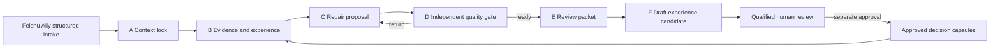

# TrialCompiler MVP 实现说明

## 1. 当前完成范围

MVP 聚焦“方案跨章节一致性审阅”，不尝试一次生成数百页真实临床文档。

已实现：

- Trial Fact Sheet 和章节数据合同；
- Clinical Document Graph 的事实到章节依赖；
- 已批准事实与文档表述冲突检测；
- A Context、B Evidence、C Repair、D Quality、E Reporter、F Experience 六角色；
- C/D 有限循环与独立质量门；
- Semantic Element 记忆库、两阶段检索接口和生命周期元数据；
- 只有已批准 Decision Capsule 可被复用；
- F 只生成待人工批准的经验候选；
- Feishu Aily 前置输入合同；
- CLI、FastAPI 和合成演示案例；
- 单元与端到端测试。

## 2. 工作流



当前演示为了可重复，不调用外部大模型。它使用同一组结构合同与 LangGraph 状态机运行确定性 Agent。模型模式的客户端和外置提示词已经预留；接入任何兼容 API 时必须显式配置，不能静默退回规则模式。

## 3. 运行

```powershell
cd D:\TrialCompiler
$env:PYTHONPATH = "src"
D:\miniconda\envs\iGEM\python.exe -m trialcompiler demo
```

输出位于 `outputs/demo/`：

- `workflow_state.json`
- `review_report.md`
- `agent_trace.jsonl`
- `memory.sqlite3`

启动 API：

```powershell
$env:PYTHONPATH = "src"
D:\miniconda\envs\iGEM\python.exe -m uvicorn apps.api.app:app --host 127.0.0.1 --port 8810
```

接口：

- `GET /health`
- `POST /api/v1/intake/feishu`
- `POST /api/v1/review`
- `POST /api/v1/memory/search`
- `GET /docs`

## 4. 合成案例结果

案例把主要终点评估时间的批准事实设为 Week 16，但 Synopsis 和 Schedule 仍写 Week 12。系统：

1. 识别两处冲突；
2. 检索一条已批准的跨章节传播经验；
3. 生成两条只改时间、不改样本量的红线；
4. 检查每条红线包含 Canonical Fact 与来源；
5. 形成待人工审阅报告；
6. 生成 `draft` 经验候选，不自动批准。

## 5. 安全边界

- 演示数据全部为合成数据；
- 质量门通过不代表医学、法规或伦理批准；
- API 不包含身份认证和生产级文件权限，不能直接承载真实患者数据；
- 未批准或过期经验不会进入 Agent 上下文；
- 当前代码不会自动覆盖原文；
- 正式产品需要 RBAC、加密、租户隔离、审计存档和合格人员电子签核。

## 6. 后续优先级

1. 建立真实脱敏或专家构造的 benchmark；
2. 用 hybrid ANN + BM25 替换 MVP FTS 粗筛；
3. 训练或校准轻量语义等价判别器；
4. 接入 Word/PDF 原文定位和红线导出；
5. 在飞书租户配置 Aily Workflow；
6. 做专家盲评、消融实验和错误分析；
7. 增加权限、有效期、撤销和组织级审批流程。
